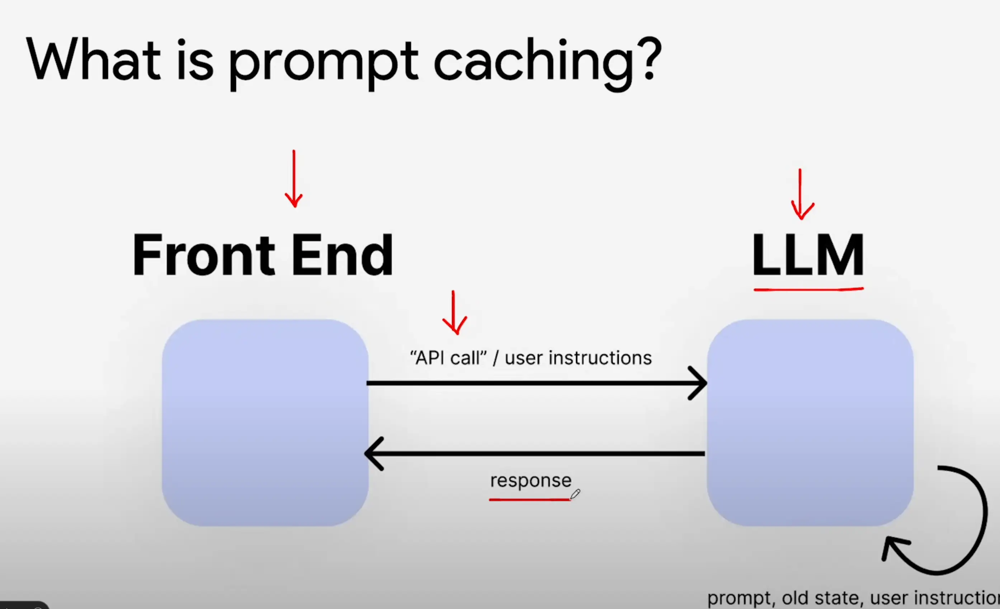
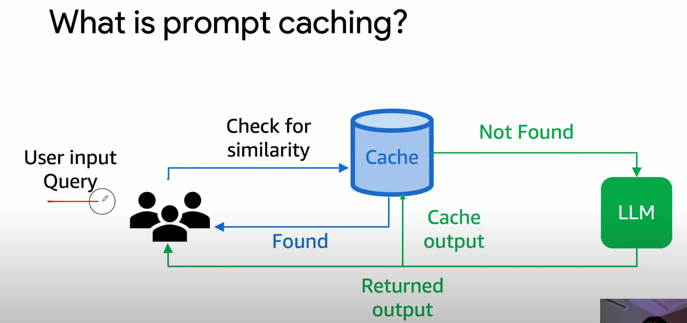
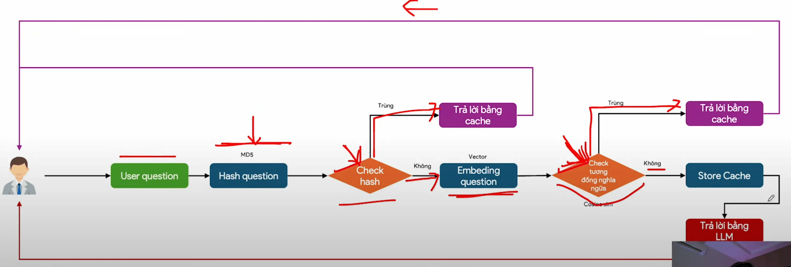

## 📘 I. Prompt Caching là gì? (Kiến thức chuẩn)



- Hiểu đúng bản chất, Prompt Caching là một kỹ thuật tối ưu khi sử dụng Large Language Models (LLMs) (như GPT, Gemini, Claude...) để:

> **Lưu trữ (cache)** các câu hỏi và câu trả lời đã từng gửi tới model, nhằm tránh gọi lại API không cần thiết, từ đó tiết kiệm chi phí, tăng tốc độ phản hồi, và giảm tải hệ thống.



### ✅ Định nghĩa chuẩn:

> **Prompt Caching** là một kỹ thuật trong hệ thống sử dụng LLM (Large Language Model) để **lưu lại các truy vấn (prompt) và kết quả (response)**. Khi gặp lại truy vấn giống hoặc tương tự, hệ thống **trả kết quả đã lưu**, không cần gọi lại model → giúp **giảm chi phí, tăng tốc, giảm tải model**.

### Mục tiêu:

- 💰 Tiết kiệm chi phí gọi API LLM (GPT-4, Claude, Gemini,...)

- ⚡ Tăng tốc phản hồi

- 🧠 Tái sử dụng kiến thức đã sinh ra

- 📉 Giảm tải hạ tầng khi self-hosting (với GPU đắt đỏ)

#### 📌 Yếu tố cần quan tâm: TTL (Time-to-Live): không cache mãi mãi — cần xóa định kỳ để tránh stale data.

## ⚙️ Có mấy loại Prompt Caching?

| Loại                    | Cách hoạt động                                                                | Ưu điểm                                 | Hạn chế                                        |
| ----------------------- | ----------------------------------------------------------------------------- | --------------------------------------- | ---------------------------------------------- |
| **Exact Match Caching** | Hash câu hỏi (VD: bằng MD5/SHA256), so sánh 100% giống                        | Nhanh, đơn giản                         | Không xử lý được câu hỏi khác cách diễn đạt    |
| **Semantic Caching**    | Embedding câu hỏi (Vector hóa) + cosine similarity để tìm câu hỏi _gần nghĩa_ | Bắt được các câu hỏi diễn đạt khác nhau | Phức tạp hơn, cần model embedding và vector DB |

### 1. **Exact Prompt Cache (Bộ nhớ truy vấn y hệt)**



- **Cơ chế**: băm câu hỏi thành mã (VD: MD5 hoặc SHA256), check xem mã đã có trong cache chưa.
- **Công nghệ**: Redis, SQLite, MongoDB, file JSON (demo).
- **Ưu điểm**: cực nhanh, đơn giản.
- **Hạn chế**: không phát hiện được các câu hỏi “gần giống” (cùng nghĩa, khác chữ).

```python
import hashlib
def hash_prompt(prompt): return hashlib.md5(prompt.encode()).hexdigest()
```

### 2. **Semantic Prompt Cache (Ngữ nghĩa)**

- **Cơ chế**:

  - Embedding prompt → vector.
  - So sánh cosine similarity với các prompt đã lưu.
  - Nếu vượt ngưỡng (ví dụ 0.90) thì coi như trùng → dùng kết quả đã cache.

- **Công nghệ**:

  - Vector DB: FAISS, Qdrant, Weaviate, Milvus
  - Embedding: `text-embedding-3-small`, `bge-m3`, `Instructor`

- **Ưu điểm**: bắt được các câu hỏi viết khác nhau nhưng cùng ý nghĩa.
- **Hạn chế**: tốn tài nguyên, cần vector store.

```python
from sentence_transformers import SentenceTransformer
model = SentenceTransformer("sentence-transformers/all-MiniLM-L6-v2")
embedding = model.encode("Thủ đô Việt Nam là gì?")
```

### 3. **Hybrid Cache (Kết hợp Exact + Semantic)**

- **Chiến lược thực tế phổ biến nhất**:

  - Bước 1: thử exact cache (hash).
  - Bước 2: nếu không có → dùng semantic cache.
  - Bước 3: nếu vẫn không có → gọi API model → lưu cache.

- **TTL** (Time to Live): mỗi prompt có thể có hạn dùng 1h, 24h, 7 ngày...

## 📦 VI. Một số tips thực tế

| Tip                                                             | Mô tả                                  |
| --------------------------------------------------------------- | -------------------------------------- |
| ✅ Dùng threshold \~0.88–0.95 cho cosine similarity             | Tùy vào yêu cầu "trùng nghĩa" khắt khe |
| ⏱️ TTL nên gắn theo loại prompt                                 | VD: tin tức 2h, policy 7 ngày          |
| 🧩 Mỗi embedding model sẽ ảnh hưởng độ chính xác semantic match | Nên benchmark                          |
| ⚠️ Không cache câu hỏi cá nhân hóa (VD: "tôi là ai?")           | Dễ trả sai kết quả                     |
| 📈 Theo dõi tỉ lệ hit/miss của cache                            | Để đánh giá hiệu quả                   |

## 📚 VII. Tài liệu khuyến nghị

- [GPTCache – GitHub](https://github.com/zilliztech/GPTCache)
- [OpenAI - Prompt Caching Guide](https://platform.openai.com/docs/guides/prompt-caching)
- [Qdrant – Vector Similarity Search](https://qdrant.tech/)
- [LangChain Memory](https://docs.langchain.com/docs/components/memory)
