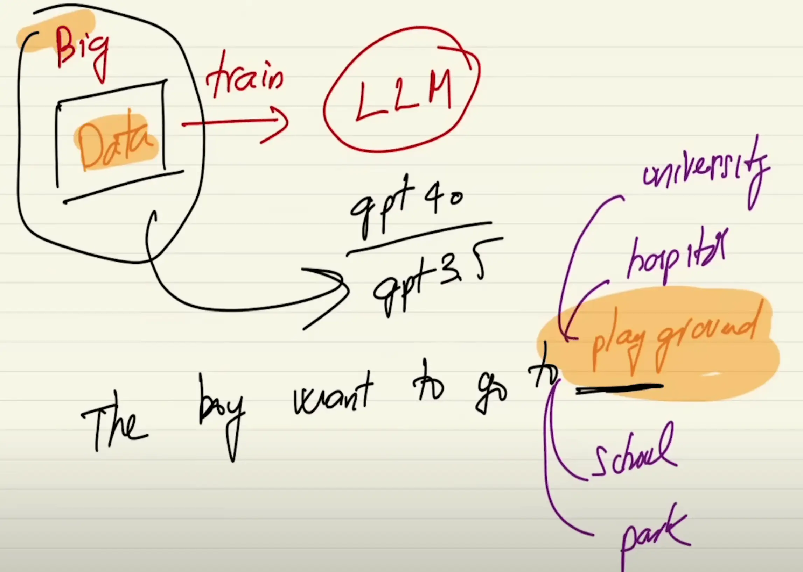
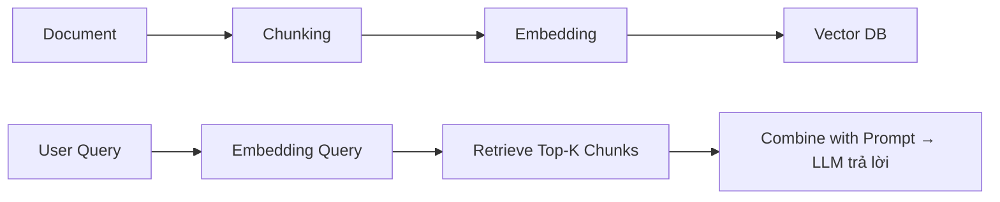

# RAG – Retrieval-Augmented Generation

## Sơ lược về các chat ai có trên thị trường

- Sơ lược trên thị trường đang có nhiều loại AI như: ChatGPT, Gemini, Claude AI, Grok.

- Tất cả các AI trên được tạo ra bằng cách kiếm một lượng lớn data (Big Data) gôm text, image

- Sau đó họ TRAIN cho con LLM cho nó thông minh. Ví dụ LLM của ChatGPT là GPT4o, GPT3.5,...

- **Khi huấn luyện với lượng lớn dữ liệu, LLM có vẻ “hiểu biết”, nhưng thật ra chỉ là "đoán đúng từ tiếp theo" dựa vào ngữ cảnh.**



### Ví dụ 1:

- Tại sao lại chọn **playground** như hình --> vì từ **playground** lúc mà nó predict (dự đoán) thì nó có cái probability (xác suất) là cái khả năng là cao nhất -> Vì trong Big Data thì những câu **the boy want to go to playground** xuất hiện nhiều nhất nên probability (xác suất) cao

- Nếu ta dùng tập dữ liệu khác mà **he boy want to go to school** xuất hiện nhiều hơn thì sẽ predict (dự đoán) **school**

### Ví dụ 2:

- input: Thủ Đô Việt Nam là gì ?
- output: Thủ độ Việt Nam là Hà Nội

==> Có đoán từ không ? **CÓ**

==> Dựa vào từng từ trong input để đoán ra đoạn output.

==> Tại sao làm được kiểu hỏi đáp như vậy. Những LLM làm được kiểu như vậy đã được fine-tune lại rồi.

==> Sau khi train một dữ liệu cực lớn Big Data thì tiếp đó người ta fine-tune bằng các cặp câu hỏi - trả lời, câu hỏi - trả lời

==> Và từ đó làm LLM tốt nhiệm vụ trả lời người dùng.

### AI trả lời:

#### 🔹 **Input: "Thủ đô Việt Nam là gì?" → Output: "Thủ đô Việt Nam là Hà Nội"**

> ✅ Có đoán từ không? → **CÓ.**
> LLM không **tra cứu** câu trả lời, mà **dự đoán** từng từ tiếp theo dựa trên xác suất cao nhất từ dữ liệu huấn luyện.

- Nó "biết" câu trả lời vì đã thấy các dạng câu tương tự nhiều lần trong quá trình huấn luyện.
- Tức là: `"Thủ đô Việt Nam là"` → mô hình đã học được rằng `"Hà Nội"` thường xuyên đi sau cụm này.

#### 🔹 **Dựa vào từng từ trong input để đoán output?**

> ✅ **Đúng.**
> LLM dùng cơ chế attention (như trong Transformer) để **xem xét toàn bộ chuỗi input** khi tạo ra từng từ trong output.

- Không phải chỉ từ cuối, mà là toàn bộ câu, thậm chí cả đoạn trước trong hội thoại.

#### 🔹 **Tại sao làm được hỏi - đáp như vậy?**

> ✅ **Vì đã được fine-tune bằng cặp Q\&A.**

- Sau khi pretrain trên dữ liệu rất lớn (big data), LLM vẫn chưa thực sự “giỏi” ở các task cụ thể như hỏi - đáp, viết code, tóm tắt...
- Vì vậy, các hãng (OpenAI, Anthropic...) thực hiện bước **fine-tuning**:

  - Dùng bộ dữ liệu có cấu trúc: _Câu hỏi – Trả lời._
  - Hoặc thậm chí dùng kỹ thuật **RLHF (Reinforcement Learning from Human Feedback)** để mô hình trả lời giống con người hơn, biết "nói chuyện".

#### 🔹 **Từ đó LLM mới giỏi hỏi - đáp**

> ✅ **Chính xác.**

- Chính các bước fine-tune (và sau đó là RLHF hoặc instruction-tuning) mới làm cho LLM biết cách trả lời rõ ràng, mạch lạc.
- Nếu chỉ dừng ở bước pretrain thì mô hình có thể biết nhiều thông tin, nhưng **trả lời sẽ không gọn gàng, không biết giữ định dạng, không hiểu yêu cầu.**

#### ✅ **Tóm lại:**

> 🔸 LLM biết trả lời vì:

> **(1)** Học từ dữ liệu lớn → Biết xác suất từ ngữ

> **(2)** Được fine-tune bằng dữ liệu Q\&A → Biết cách phản hồi đúng câu hỏi

> **(3)** Có cơ chế attention → Phân tích toàn bộ câu để dự đoán từ tiếp theo

---

## Why RAG & What RAG

Câu hỏi rất trọng tâm: **Nếu LLM đã thông minh và biết trả lời thì tại sao còn cần RAG?**

## ✅ **1. Vì LLM _không biết dữ liệu mới, riêng, nội bộ_**

> Dù LLM được huấn luyện với dữ liệu rất lớn, nhưng:

- Nó **không biết thông tin sau thời điểm huấn luyện** (cut-off date).
- Nó **không biết dữ liệu nội bộ của tổ chức/công ty bạn**.
- Nó **không biết văn bản bạn đang xử lý**, ví dụ như hợp đồng, báo cáo, file PDF, nội quy công ty...

🧠 **LLM = thông minh tổng quát (general)**
📚 **RAG = cung cấp kiến thức cụ thể (domain knowledge)**

## ✅ **2. Vì LLM không thể nhớ toàn bộ thế giới**

- Không thể nhồi toàn bộ tri thức vào mô hình (cả về giới hạn token, cả về khả năng học).
- Với những thông tin chi tiết như:

  - **Chính sách công ty**
  - **Sản phẩm nội bộ**
  - **Luật pháp địa phương**
  - **Số liệu tài chính**

  ➜ Chắc chắn **LLM không có**, mà phải **truy xuất (retrieve)**.

## ✅ **3. Vì RAG giúp cập nhật theo thời gian thực**

- Nếu công ty bạn thay đổi chính sách hôm qua → không thể fine-tune lại GPT ngay.
- Với RAG, bạn chỉ cần:

  - **Cập nhật văn bản vào vector DB**
  - → LLM dùng thông tin mới ngay lập tức

⏱ Không cần retrain, không cần fine-tune, nhanh gọn.

## ✅ **4. Vì RAG giúp kiểm soát nguồn thông tin**

- Với RAG, bạn biết: “Câu trả lời này đến từ đoạn văn bản nào?”
- Giúp:

  - **Giải thích được (explainability)**
  - **Tránh bịa (hallucination)**: vì LLM bị ép chỉ dùng đúng tài liệu được đưa vào.

## ✅ **5. Vì RAG rẻ hơn nhiều so với fine-tune**

- Fine-tune LLM cần GPU, tiền, thời gian → không phải ai cũng làm được.
- RAG chỉ cần: embedding + vector DB (như FAISS, Qdrant...) + 1 LLM như GPT-4 → xong.

## ✅ **Tóm lại, cần RAG vì:**

| Lý do                                | Giải thích                                       |
| ------------------------------------ | ------------------------------------------------ |
| 🧠 Không biết dữ liệu nội bộ         | LLM không “biết” văn bản, tài liệu riêng của bạn |
| 📅 Không cập nhật thời gian thực     | LLM không thể biết dữ liệu sau ngày cut-off      |
| 💸 Fine-tune đắt đỏ, khó làm         | RAG nhanh, rẻ, dễ triển khai                     |
| 📚 Truy xuất đúng nội dung cần thiết | Không cần đưa cả tài liệu vào prompt             |
| ❌ Giảm bịa, tăng tin cậy            | Chỉ trả lời dựa trên dữ liệu bạn cung cấp        |

👉 **RAG = cách biến LLM thành chuyên gia hiểu dữ liệu riêng của bạn.**

Không RAG → LLM chỉ là một “ông nói hay” nhưng không biết chuyện trong nhà bạn.

---

## How RAG ?

### 1. Document ?

#### ✅ Document trong RAG là gì?

Trong bối cảnh của RAG, **Document** không chỉ là file như PDF hay Word, mà là **đơn vị chứa thông tin có thể được truy vấn và dùng làm context cho LLM**.

---

## 🎯 Có 2 khái niệm quan trọng cần phân biệt:

| Khái niệm             | Ý nghĩa                                                                            |
| --------------------- | ---------------------------------------------------------------------------------- |
| 📄 **Document (thô)** | Tài liệu đầu vào gốc: PDF, DOCX, TXT, HTML, JSON, website...                       |
| 📑 **Chunk (đoạn)**   | Đoạn văn bản được tách ra từ document, có kích thước nhỏ phù hợp để đưa vào prompt |

#### 📌 Các loại Document phổ biến dùng trong RAG:

1. **PDF**: báo cáo tài chính, hợp đồng, nội quy công ty
2. **Word (DOCX)**: biểu mẫu, văn bản hành chính
3. **TXT / Markdown**: hướng dẫn kỹ thuật, tài liệu lập trình
4. **HTML / Web page**: trang FAQ, chính sách sản phẩm
5. **Email / Chat Logs**: dữ liệu nội bộ, hỏi đáp nhân sự
6. **JSON / CSV**: data bán cấu trúc như sản phẩm, học sinh, lịch...

#### 🧠 Vì sao không đưa nguyên file vào LLM?

- Không đủ **token limit** → GPT-4 Turbo chỉ nhận \~128k tokens, trong khi file nội quy có thể dài hàng trăm ngàn từ.
- Không hiệu quả: LLM chỉ cần **một đoạn liên quan**, không cần toàn bộ văn bản.

#### 🧰 Cách xử lý Document trong RAG:

| Bước                     | Công cụ                                                 | Ghi chú                                |
| ------------------------ | ------------------------------------------------------- | -------------------------------------- |
| 1. Đọc file              | `pdfplumber`, `PyMuPDF`, `python-docx`, `BeautifulSoup` | Trích văn bản                          |
| 2. Chia chunk            | `LangChain.TextSplitter`, hoặc chia theo đoạn/tokens    | Kích thước chunk thường 300–500 tokens |
| 3. Tạo embedding         | OpenAI, Cohere, BGE, SentenceTransformer                | Vector hóa nội dung từng chunk         |
| 4. Lưu vector + raw text | FAISS, Qdrant, Weaviate...                              | Phục vụ truy vấn về sau                |

## ✅ Tóm tắt:

> **Document = tài liệu chứa tri thức mà LLM cần biết thêm**
> Trong RAG, ta:

- **Chuyển document thành các đoạn nhỏ**
- **Tạo embedding cho mỗi đoạn**
- **Lưu để tìm lại đúng lúc cần trả lời**

---

### 2. Vector DB ?

### ✅ Vector DB trong RAG

#### 1. 🔹 **Vector DB là gì?**

**Vector Database** là **cơ sở dữ liệu lưu trữ và truy vấn các vector** – tức là các dãy số thực đại diện cho ý nghĩa của đoạn văn bản (embedding).

- Mỗi đoạn văn bản (chunk) → chuyển thành **vector** (ví dụ: 1536 chiều).
- Các vector này **không thể tìm kiếm bằng SQL thông thường**, vì ta cần tìm theo “độ gần về ngữ nghĩa”.

📌 Vector DB giúp ta tìm:

> **“Đoạn văn bản nào gần nghĩa nhất với câu hỏi người dùng?”**

#### 2. 🔹 **Vector DB hoạt động như thế nào?**

#### Bên trong Vector DB gồm 3 thành phần chính:

| Thành phần      | Ý nghĩa                                                        |
| --------------- | -------------------------------------------------------------- |
| 📈 **Vector**   | Embedding của đoạn văn bản (1 dãy số float)                    |
| 🧾 **Raw text** | Nội dung gốc: đoạn văn bản thô                                 |
| 🏷 **Metadata**  | Dữ liệu phụ: file nguồn, vị trí, người dùng, quyền truy cập... |

#### 3. 🔹 **Khi nào dùng Vector DB?** (Trong flow RAG)

#### Khi người dùng gửi câu hỏi:

1. Câu hỏi → tạo embedding vector (giống như document).
2. Vector DB dùng thuật toán **Approximate Nearest Neighbors (ANN)** để tìm **K vector gần nhất**.
3. Lấy lại các đoạn văn bản gốc tương ứng → đưa vào prompt → gửi đến LLM.

#### 4. 🔹 **Một số Vector DB phổ biến hiện nay**

| Tên              | Tính năng nổi bật                     | Ghi chú                       |
| ---------------- | ------------------------------------- | ----------------------------- |
| **FAISS** (Meta) | Nhanh, nhẹ, local                     | Phù hợp demo, dự án nhỏ       |
| **Qdrant**       | Open-source, hỗ trợ filter + REST API | Tốt cho production            |
| **Weaviate**     | Tích hợp semantic search, GraphQL     | Có thể nhúng external data    |
| **Pinecone**     | SaaS, hiệu suất cao, scale tốt        | Dùng trong nhiều hệ thống lớn |
| **Milvus**       | Tối ưu cho dữ liệu lớn                | Do Zilliz phát triển          |

#### 5. 🔹 Hình dung Vector DB như thế này:

Rõ ràng. Dưới đây là **ví dụ cụ thể liên quan trực tiếp đến bảng bạn đưa ra**. Mình sẽ giữ nguyên cấu trúc bảng, mở rộng thêm **2 hàng nữa**, và thêm ví dụ câu hỏi → chọn dòng nào.

```text
┌────────────┬────────────────────────────────────────────────────────────┬──────────────────────────────--------------┐
│  Vector    │ Raw Text                                                   │ Metadata                                   │
├────────────┼────────────────────────────────────────────────────────────┼──────────────────────────────--------------┤
│ [0.12,     │ “Nhân viên thử việc được nghỉ 1 ngày phép mỗi tháng.”      │ {doc_id: "hr", page: 3, role: "user"}      │
│  0.98,...] │                                                            │                                            │
├────────────┼────────────────────────────────────────────────────────────┼──────────────────────────────--------------┤
│ [0.45,     │ “Nhân viên chính thức được nghỉ 12 ngày phép mỗi năm.”     │ {doc_id: "hr", page: 5,role: "user}        │
│  0.65,...] │                                                            │                                            │
├────────────┼────────────────────────────────────────────────────────────┼──────────────────────────────--------------┤
│ [0.77,     │ “Thời gian thử việc tối đa là 2 tháng đối với nhân viên.”  │ {doc_id: "hr", page: 2,role: "user}        │
│  0.34,...] │                                                            │                                            │
└────────────┴────────────────────────────────────────────────────────────┴──────────────────────────────--------------┤
```

### ✅ Các ví dụ truy vấn & kết quả tìm hàng:

| 🧠 **User hỏi**                                     | 🔍 **So khớp nội dung**                             | ✅ **Row phù hợp** |
| --------------------------------------------------- | --------------------------------------------------- | ------------------ |
| “Thử việc được nghỉ bao nhiêu ngày phép mỗi tháng?” | Gần nhất với Raw Text nói về **nghỉ phép thử việc** | 👉 **Row 1**       |
| “Nhân viên chính thức được bao nhiêu ngày phép?”    | Gần nhất với đoạn về **12 ngày phép mỗi năm**       | 👉 **Row 2**       |
| “Thử việc tối đa mấy tháng?”                        | Gần nhất với đoạn nói **thử việc tối đa 2 tháng**   | 👉 **Row 3**       |

### ✅ Tóm gọn flow xử lý:

1. Người dùng hỏi: `"Thử việc được nghỉ bao nhiêu ngày?"`
2. Câu hỏi được nhúng thành vector → so sánh với 3 vector trong bảng.
3. Cosine similarity cho thấy **vector Row 1 gần nhất** → lấy đoạn text đó.
4. Đưa đoạn đó vào prompt → LLM trả lời:

   > “Nhân viên thử việc được nghỉ 1 ngày phép mỗi tháng.”

#### 6. 🔍 Các thuật toán đo độ gần vector (vector similarity):

| Thuật toán         | Ứng dụng                            |
| ------------------ | ----------------------------------- |
| Cosine similarity  | Phổ biến nhất (góc giữa hai vector) |
| Euclidean distance | Khoảng cách đường thẳng             |
| Dot product        | Khi các vector đã được chuẩn hóa    |

## ✅ Tóm tắt:

> **Vector DB là nơi lưu trữ tri thức dưới dạng vector để LLM có thể “nhớ lại” đúng chỗ, đúng lúc.**
> Không có Vector DB → LLM không thể biết đoạn nào liên quan đến câu hỏi.

---

### 3. Chunking ?

**Chunking** là quá trình **chia nhỏ tài liệu (document)** thành các **đoạn văn bản ngắn (chunk)** trước khi nhúng (embedding) vào Vector DB.

## 🔹 **Vì sao cần chunking?**

1. **Mô hình chỉ embed được một lượng token giới hạn** (ví dụ 512 hoặc 1024 token/lượt).
2. Nếu không chia, embedding cả tài liệu dài → **mất ngữ cảnh, gây nhiễu**.
3. Chunking giúp:

   - Gắn metadata cụ thể cho từng phần (ví dụ: `page: 3`, `section: 4.2`)
   - Tăng khả năng tìm đúng đoạn khi search
   - Tránh mất thông tin vì quá dài

## 🔹 **Ví dụ minh họa**

### 📄 Tài liệu gốc:

```text
Trang 1:
“Chính sách nghỉ phép: Nhân viên chính thức được nghỉ 12 ngày phép/năm. Nhân viên thử việc được nghỉ 1 ngày phép/tháng.”

Trang 2:
“Thời gian thử việc tối đa là 2 tháng. Trong thời gian này, lương thử việc có thể thấp hơn 85% lương chính thức.”
```

### 🔹 Chunking kết quả:

| Chunk | Raw Text                                               | Metadata                    |
| ----- | ------------------------------------------------------ | --------------------------- |
| #1    | “Nhân viên chính thức được nghỉ 12 ngày phép/năm.”     | {doc_id: "policy", page: 1} |
| #2    | “Nhân viên thử việc được nghỉ 1 ngày phép/tháng.”      | {doc_id: "policy", page: 1} |
| #3    | “Thời gian thử việc tối đa là 2 tháng.”                | {doc_id: "policy", page: 2} |
| #4    | “Lương thử việc có thể thấp hơn 85% lương chính thức.” | {doc_id: "policy", page: 2} |

## 🔹 Các phương pháp chunking phổ biến

| Cách chunk            | Mô tả ngắn                                           | Khi nào dùng                  |
| --------------------- | ---------------------------------------------------- | ----------------------------- |
| **By paragraph**      | Mỗi đoạn văn là 1 chunk                              | Với văn bản logic, kỹ thuật   |
| **By fixed-length**   | Cắt theo token (VD: 200 tokens/chunk)                | Với nội dung không có đoạn rõ |
| **Sliding window**    | Cắt chồng lấn (VD: chunk 1: 0-200, chunk 2: 100-300) | Giữ ngữ cảnh liên tục         |
| **Semantic chunking** | Chia theo chủ đề/ý nghĩa gần nhau (dùng NLP)         | Khi cần độ chính xác cao nhất |

## ✅ Tóm tắt:

> **Chunking** là bước đầu tiên quan trọng trong RAG, giúp **cắt tài liệu lớn thành từng đoạn nhỏ có nghĩa**, sau đó đem đi nhúng và lưu vào Vector DB.

---

### 4. Retrieve ?

### ✅ **Retrieve** là gì trong RAG?

**Retrieve (truy vấn)** là bước lấy ra những đoạn văn bản (chunk) **liên quan nhất đến câu hỏi của người dùng**, dựa trên sự giống nhau về ý nghĩa (semantic similarity) giữa **vector câu hỏi** và **vector các chunk đã lưu trong Vector DB**.

## 🔁 Vị trí của Retrieve trong pipeline RAG:



## 🧠 Ví dụ đơn giản:

### ✅ Vector DB đã lưu:

| Chunk                                    | Metadata |
| ---------------------------------------- | -------- |
| “Nhân viên thử việc được nghỉ 1 ngày…”   | page: 3  |
| “Nhân viên chính thức được nghỉ 12 ngày” | page: 5  |
| “Thử việc tối đa là 2 tháng”             | page: 2  |

### ✅ User hỏi:

**"Thử việc tối đa bao lâu?"**

### 🔍 Các bước Retrieve:

1. Câu hỏi `"Thử việc tối đa bao lâu?"` → nhúng thành vector
2. So sánh vector câu hỏi với vector từng chunk bằng **cosine similarity**
3. Trả về **K chunk gần nhất** (thường Top-3)
4. Đưa raw text các chunk này vào LLM → dùng làm **context để trả lời**

## 🔧 Công thức tính độ giống (Cosine Similarity)

$$
\text{similarity}(\vec{q}, \vec{c}) = \frac{\vec{q} \cdot \vec{c}}{|\vec{q}| |\vec{c}|}
$$

Trong đó:

- $\vec{q} \cdot \vec{c}$: tích vô hướng (dot product)
- $|\vec{q}|$: độ dài (norm) của vector q
- $|\vec{c}|$: độ dài của vector c
- Giá trị kết quả nằm trong khoảng:

  - $-1$: hoàn toàn ngược hướng
  - $0$: vuông góc (không liên quan)
  - $1$: hoàn toàn giống

## ✅ Tóm tắt

| Thành phần     | Ý nghĩa                                                                  |
| -------------- | ------------------------------------------------------------------------ |
| Input          | Câu hỏi người dùng                                                       |
| Output         | Danh sách các đoạn văn bản gần nhất trong Vector DB                      |
| Mục đích       | Cung cấp **context liên quan nhất** để LLM trả lời chính xác và ngắn gọn |
| Công nghệ dùng | Cosine similarity, FAISS/Qdrant/Weaviate,...                             |

---
