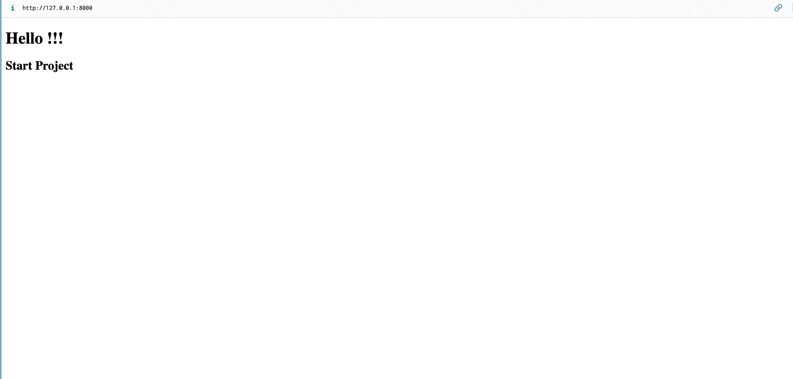

`from __future__ import annotations` là một import statement đặc biệt trong Python có ý nghĩa như sau:

**Mục đích chính:**

- Cho phép sử dụng **deferred evaluation** (đánh giá trì hoãn) cho type annotations
- Tất cả các type annotations sẽ được lưu dưới dạng string thay vì được evaluate ngay lập tức

**Lợi ích:**

1. **Giải quyết forward references**: Bạn có thể reference đến các class chưa được định nghĩa

```python
from __future__ import annotations

class Node:
    def __init__(self, value: int, next_node: Node = None):  # Node chưa được define xong
        self.value = value
        self.next = next_node
```

2. **Cải thiện performance**: Type annotations không được evaluate lúc import, giúp tăng tốc độ khởi động

3. **Tương thích với Python cũ hơn**: Cho phép sử dụng syntax mới trên Python cũ (như `list[int]` thay vì `List[int]`)

4. **Hỗ trợ self-referencing types**: Class có thể reference chính nó trong type hints

**Lưu ý:**

- Từ Python 3.10+, behavior này sẽ trở thành mặc định
- **Trong Python 3.11+, bạn không cần thiết phải import này nữa cho hầu hết trường hợp**
- Nó chỉ ảnh hưởng đến type annotations, không ảnh hưởng đến runtime behavior

Trong context của FastAPI app, việc này thường được dùng để tránh circular import issues khi định nghĩa các model classes có reference lẫn nhau.

---

---

```python
# backend/main.py
from pathlib import Path
from typing import Final

from fastapi import FastAPI, HTTPException, status
from fastapi.responses import HTMLResponse
from fastapi.staticfiles import StaticFiles


# -----------------------------------------------------------------------------
# Application setup
# -----------------------------------------------------------------------------

APP_TITLE: Final[str] = "Recipe Chatbot"
app = FastAPI(title=APP_TITLE)

# Serve static assets (currently just the HTML) under `/static/*`.
STATIC_DIR = Path(__file__).parent.parent / "frontend"
app.mount("/static", StaticFiles(directory=STATIC_DIR), name="static")

#...

```

Đây là phần setup cơ bản cho FastAPI application. Tôi sẽ giải thích từng phần:

## **Imports**

```python
from pathlib import Path
from typing import Final, List, Dict
```

- **pathlib.Path**: Cách hiện đại để làm việc với file paths, cross-platform
- **typing.Final**: Type hint cho constant (không thể thay đổi)
- **List, Dict**: Type hints cho collections (có thể không dùng trong đoạn này)

## **Application Configuration**

```python
APP_TITLE: Final[str] = "Recipe Chatbot"
app = FastAPI(title=APP_TITLE)
```

- **APP_TITLE**: Constant định nghĩa tên ứng dụng
- **app = FastAPI(...)**: Tạo FastAPI instance với title, sẽ hiển thị trong:
  - Swagger UI documentation (`/docs`)
  - ReDoc documentation (`/redoc`)
  - OpenAPI schema

## **Static File Serving**

```python
STATIC_DIR = Path(__file__).parent.parent / "frontend"
app.mount("/static", StaticFiles(directory=STATIC_DIR), name="static")
```

**Phân tích đường dẫn:**

- `Path(__file__)`: Đường dẫn đến file Python hiện tại
- `.parent.parent`: Đi lên 2 cấp thư mục
- `/ "frontend"`: Vào thư mục frontend

**Cấu trúc dự kiến:**

```
project/
├── backend/
│   └── main.py  (file này)
├── frontend/    (STATIC_DIR trỏ đây)
│   ├── index.html
│   ├── style.css
│   └── script.js
```

**Mount static files:**

- URL `/static/*` sẽ serve files từ thư mục `frontend/`
- Ví dụ: `/static/index.html` → `frontend/index.html`
- `name="static"`: Tên internal để reference trong FastAPI

## **Mục đích**

Setup này cho phép:

1. Serve API endpoints từ FastAPI
2. Serve frontend files (HTML, CSS, JS) từ cùng một server
3. Tạo full-stack application trong một project

---

---

```python
# backend/main.python

#...
#...
# -----------------------------------------------------------------------------
# Routes
# -----------------------------------------------------------------------------


@app.get("/", response_class=HTMLResponse)
async def index() -> HTMLResponse:  # noqa: WPS430
    """Serve the chat UI."""

    html_path = STATIC_DIR / "index.html"
    if not html_path.exists():
        raise HTTPException(
            status_code=status.HTTP_404_NOT_FOUND,
            detail="Frontend not found. Did you forget to build it?",
        )

    return HTMLResponse(html_path.read_text(encoding="utf-8"))

```

Đây là route handler để serve trang chủ của ứng dụng. Tôi sẽ giải thích từng phần:

## **Route Definition**

```python
@app.get("/", response_class=HTMLResponse)
```

- **@app.get("/")**: Decorator định nghĩa HTTP GET endpoint cho root path "/"
- **response_class=HTMLResponse**: Chỉ định response sẽ trả về HTML content (thay vì JSON mặc định)

## **Function Signature**

```python
async def index() -> HTMLResponse:  # noqa: WPS430
```

- **async def**: Hàm bất đồng bộ, cho phép handle nhiều requests concurrent
- **-> HTMLResponse**: Type hint cho return type
- **# noqa: WPS430**: Comment để ignore specific linting rule (có thể là về naming convention)

## **Function Logic**

**1. Tìm file HTML:**

```python
html_path = STATIC_DIR / "index.html"
```

- Tạo Path object trỏ đến `frontend/index.html`
- Sử dụng pathlib syntax `/` để join paths

**2. Kiểm tra file tồn tại:**

```python
if not html_path.exists():
    raise HTTPException(
        status_code=status.HTTP_404_NOT_FOUND,
        detail="Frontend not found. Did you forget to build it?",
    )
```

- **Error handling**: Nếu file không tồn tại → HTTP 404
- **Helpful error message**: Gợi ý developer có thể quên build frontend

**3. Đọc và trả về HTML:**

```python
return HTMLResponse(html_path.read_text(encoding="utf-8"))
```

- **read_text()**: Đọc toàn bộ nội dung file thành string
- **encoding="utf-8"**: Đảm bảo encoding đúng cho Vietnamese/special chars
- **HTMLResponse()**: Wrap content thành HTTP response với proper headers

## **Mục đích**

Route này:

1. **Single Page Application (SPA)**: Serve file `index.html` làm entry point
2. **Error handling**: Báo lỗi rõ ràng nếu frontend chưa ready
3. **Direct serving**: Thay vì dùng static mount, đọc file trực tiếp (có thể để customize response)

## **Khi nào được gọi**

- User truy cập `http://localhost:8000/`
- Browser nhận HTML content và render trang chat UI

```bash
  uvicorn backend.main:app --reload
  # Open http://127.0.0.1:8000
```


