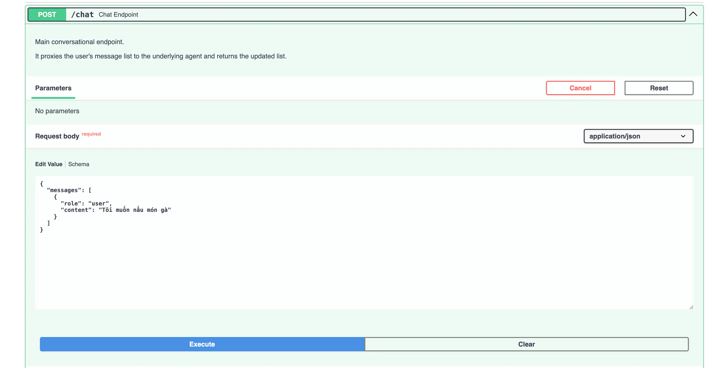
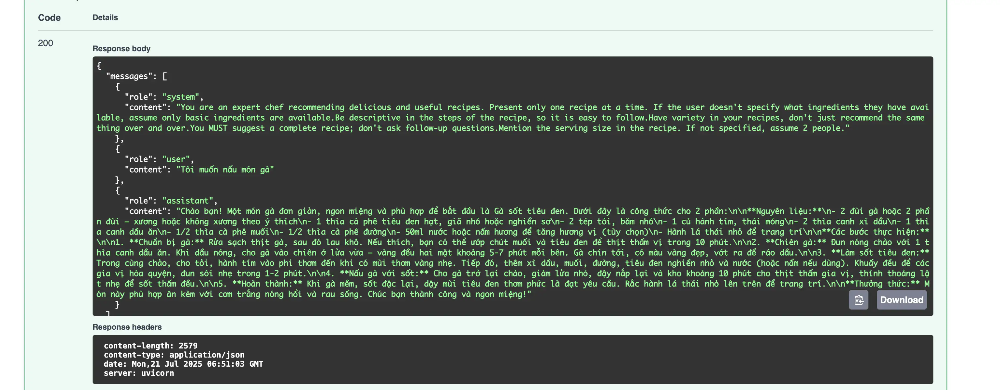

```python

# backend/main.py

#...
#...

# -----------------------------------------------------------------------------
# Request / response models
# -----------------------------------------------------------------------------


class ChatMessage(BaseModel):
    """Schema for a single message in the chat history."""

    role: str = Field(
        ..., description="Role of the message sender (system, user, or assistant)."
    )
    content: str = Field(..., description="Content of the message.")


class ChatRequest(BaseModel):
    """Schema for incoming chat messages."""

    messages: List[ChatMessage] = Field(
        ..., description="The entire conversation history."
    )


class ChatResponse(BaseModel):
    """Schema for the assistant's reply returned to the front-end."""

    messages: List[ChatMessage] = Field(
        ..., description="The updated conversation history."
    )


#...
#...


```

Đây là phần định nghĩa các **data models** sử dụng Pydantic để validate và serialize dữ liệu. Tôi sẽ giải thích chi tiết:

## **Base Class**

```python
class ChatMessage(BaseModel):
```

- **BaseModel**: Từ Pydantic, cung cấp automatic validation, serialization/deserialization
- Tương đương với DTO (Data Transfer Object) trong các ngôn ngữ khác

## **ChatMessage Model**

```python
class ChatMessage(BaseModel):
    role: str = Field(..., description="Role of the message sender (system, user, or assistant).")
    content: str = Field(..., description="Content of the message.")
```

**Các trường dữ liệu:**

- **role**: Vai trò người gửi tin nhắn
  - `"system"`: Hệ thống (instructions, context)
  - `"user"`: Người dùng
  - `"assistant"`: AI chatbot
- **content**: Nội dung tin nhắn thực tế

**Field parameters:**

- **`...`** (Ellipsis): Required field, không có default value
- **description**: Mô tả cho API documentation (Swagger UI)

## **ChatRequest Model**

```python
class ChatRequest(BaseModel):
    messages: List[ChatMessage] = Field(..., description="The entire conversation history.")
```

**Mục đích:** Schema cho request từ frontend đến API

- **messages**: Toàn bộ lịch sử conversation
- **List[ChatMessage]**: Array các tin nhắn theo format ChatMessage

**Example JSON:**

```json
{
  "messages": [
    { "role": "user", "content": "Tôi muốn nấu phở" },
    { "role": "assistant", "content": "Tôi sẽ giúp bạn công thức phở..." }
  ]
}
```

## **ChatResponse Model**

```python
class ChatResponse(BaseModel):
    messages: List[ChatMessage] = Field(..., description="The updated conversation history.")
```

**Mục đích:** Schema cho response từ API về frontend

- **messages**: Lịch sử conversation đã được update (bao gồm reply mới từ AI)

**Example JSON:**

```json
{
  "messages": [
    { "role": "user", "content": "Tôi muốn nấu phở" },
    { "role": "assistant", "content": "Tôi sẽ giúp bạn công thức phở..." },
    { "role": "user", "content": "Cần những nguyên liệu gì?" },
    { "role": "assistant", "content": "Bạn cần: xương bò, bánh phở..." }
  ]
}
```

## **Lợi ích của Pydantic Models**

1. **Automatic validation**: Tự động kiểm tra type, required fields
2. **JSON serialization**: Tự động convert object ↔ JSON
3. **API documentation**: Tự động generate OpenAPI schema
4. **IDE support**: Autocomplete, type checking
5. **Error handling**: Trả về validation errors rõ ràng

## **Flow hoạt động**

1. **Frontend** gửi ChatRequest → **Backend**
2. **Backend** xử lý, gọi LLM
3. **Backend** trả về ChatResponse → **Frontend**
4. **Frontend** update UI với conversation history mới

Đây là pattern chuẩn cho REST API với proper data validation!

---

---

```python

#  backend/utils.py

from __future__ import annotations

"""Utility helpers for the recipe chatbot backend.

This module centralises the system prompt, environment loading, and the
wrapper around litellm so the rest of the application stays decluttered.
"""

import os
from typing import Final, List, Dict

import litellm  # type: ignore
from dotenv import load_dotenv

# Ensure the .env file is loaded as early as possible.
load_dotenv(override=False)

# --- Constants -------------------------------------------------------------------

SYSTEM_PROMPT: Final[str] = (
    "You are an expert chef recommending delicious and useful recipes. "
    "Present only one recipe at a time. If the user doesn't specify what ingredients "
    "they have available, assume only basic ingredients are available."
    "Be descriptive in the steps of the recipe, so it is easy to follow."
    "Have variety in your recipes, don't just recommend the same thing over and over."
    "You MUST suggest a complete recipe; don't ask follow-up questions."
    "Mention the serving size in the recipe. If not specified, assume 2 people."
)

# Fetch configuration *after* we loaded the .env file.
MODEL_NAME: Final[str] = os.environ.get("MODEL_NAME", "gpt-4o-mini")


# --- Agent wrapper ---------------------------------------------------------------


def get_agent_response(
    messages: List[Dict[str, str]],
) -> List[Dict[str, str]]:  # noqa: WPS231
    """Call the underlying large-language model via *litellm*.

    Parameters
    ----------
    messages:
        The full conversation history. Each item is a dict with "role" and "content".

    Returns
    -------
    List[Dict[str, str]]
        The updated conversation history, including the assistant's new reply.
    """

    # litellm is model-agnostic; we only need to supply the model name and key.
    # The first message is assumed to be the system prompt if not explicitly provided
    # or if the history is empty. We'll ensure the system prompt is always first.
    current_messages: List[Dict[str, str]]
    if not messages or messages[0]["role"] != "system":
        current_messages = [{"role": "system", "content": SYSTEM_PROMPT}] + messages
    else:
        current_messages = messages

    completion = litellm.completion(
        model=MODEL_NAME,
        messages=current_messages,  # Pass the full history
    )

    assistant_reply_content: str = completion["choices"][0]["message"][
        "content"
    ].strip()  # type: ignore[index]

    # Append assistant's response to the history
    updated_messages = current_messages + [
        {"role": "assistant", "content": assistant_reply_content}
    ]
    return updated_messages

```

Đây là module **utilities** chứa các helper functions và configuration cho chatbot. Tôi sẽ giải thích chi tiết:

## **Module Purpose & Imports**

```python
from __future__ import annotations
```

- Cho phép forward references trong type hints (đã giải thích ở câu hỏi đầu)

```python
import litellm  # type: ignore
from dotenv import load_dotenv
```

- **litellm**: Unified interface cho nhiều LLM providers
- **dotenv**: Load environment variables từ file .env
- **# type: ignore**: Bỏ qua type checking warnings cho litellm

## **Environment Loading**

```python
load_dotenv(override=False)
```

- **load_dotenv()**: Đọc file `.env` và load variables vào `os.environ`
- **override=False**: Không ghi đè environment variables đã tồn tại
- **"as early as possible"**: Load ngay để các constant phía dưới có thể access

## **System Prompt Configuration**

```python
SYSTEM_PROMPT: Final[str] = (
    "You are an expert chef recommending delicious and useful recipes. "
    # ... rest of prompt
)
```

**Phân tích prompt:**

- **Role definition**: "expert chef" - định nghĩa vai trò AI
- **Constraint**: "one recipe at a time" - giới hạn output
- **Assumption**: "assume basic ingredients" - xử lý thiếu thông tin
- **Quality requirement**: "descriptive steps" - đảm bảo recipe dễ follow
- **Variety**: "don't recommend same thing" - tránh lặp lại
- **Completeness**: "MUST suggest complete recipe" - không hỏi thêm
- **Default serving**: "assume 2 people" - xử lý missing info

## **Model Configuration**

```python
MODEL_NAME: Final[str] = os.environ.get("MODEL_NAME", "gpt-4o-mini")
```

- **os.environ.get()**: Lấy biến môi trường với fallback
- **"gpt-4o-mini"**: Default model nếu không set trong .env
- **Final**: Constant không thay đổi

## **Agent Wrapper Function**

**Function signature:**

```python
def get_agent_response(
    messages: List[Dict[str, str]],
) -> List[Dict[str, str]]:
```

- **Input**: List các messages (conversation history)
- **Output**: Updated conversation history (bao gồm AI reply)

**System prompt injection:**

```python
if not messages or messages[0]["role"] != "system":
    current_messages = [{"role": "system", "content": SYSTEM_PROMPT}] + messages
else:
    current_messages = messages
```

- **Đảm bảo system prompt luôn ở đầu** conversation
- Nếu chưa có hoặc message đầu không phải "system" → thêm vào
- Nếu đã có → giữ nguyên

**LLM API call:**

```python
completion = litellm.completion(
    model=MODEL_NAME,
    messages=current_messages,
)
```

- **litellm.completion()**: Unified API cho tất cả LLM providers
- **model**: Tên model (từ env variable)
- **messages**: Full conversation history

**Response processing:**

```python
assistant_reply_content: str = completion["choices"][0]["message"]["content"].strip()

updated_messages = current_messages + [
    {"role": "assistant", "content": assistant_reply_content}
]
```

- Extract nội dung reply từ API response
- **strip()**: Remove whitespace thừa
- Append AI reply vào conversation history
- Return updated history

## **Architecture Benefits**

1. **Separation of concerns**: Logic LLM tách riêng khỏi FastAPI routes
2. **Configuration centralized**: Tất cả config ở một chỗ
3. **Model agnostic**: Dễ dàng switch giữa OpenAI, Claude, Gemini, etc.
4. **Conversation state**: Maintain full chat history
5. **Consistent system prompt**: Đảm bảo AI behavior consistent

Đây là pattern tốt để organize code trong AI applications!

---

---

```python
# backend/main.py
#...
#...
from backend.utils import get_agent_response  # noqa: WPS433 import from parent
#...
#...


#...
#...

# -----------------------------------------------------------------------------
# Routes
# -----------------------------------------------------------------------------


@app.post("/chat", response_model=ChatResponse)
async def chat_endpoint(payload: ChatRequest) -> ChatResponse:  # noqa: WPS430
    """Main conversational endpoint.

    It proxies the user's message list to the underlying agent and returns the updated list.
    """
    # Convert Pydantic models to simple dicts for the agent
    request_messages: List[Dict[str, str]] = [
        msg.model_dump() for msg in payload.messages
    ]

    try:
        # get_agent_response import từ backend.utils
        updated_messages_dicts = get_agent_response(request_messages)
    except Exception as exc:  # noqa: BLE001 broad; surface as HTTP 500
        # In production you would log the traceback here.
        raise HTTPException(
            status_code=status.HTTP_500_INTERNAL_SERVER_ERROR,
            detail=str(exc),
        ) from exc

    response = ChatResponse(
        messages=[ChatMessage(**msg) for msg in updated_messages_dicts]
    )

    # Save trace (request and response) in one place
    traces_dir = Path(__file__).parent.parent / "annotation" / "traces"
    traces_dir.mkdir(parents=True, exist_ok=True)
    ts = datetime.datetime.now().strftime("%Y%m%d_%H%M%S_%f")
    trace_path = traces_dir / f"trace_{ts}.json"
    with open(trace_path, "w") as f:
        json.dump(
            {"request": payload.model_dump(), "response": response.model_dump()}, f
        )

    return response

#...
#...

```

Đây là **main endpoint** xử lý chat requests. Tôi sẽ giải thích chi tiết từng phần:

## **Route Definition**

```python
@app.post("/chat", response_model=ChatResponse)
async def chat_endpoint(payload: ChatRequest) -> ChatResponse:
```

- **@app.post("/chat")**: HTTP POST endpoint tại `/chat`
- **response_model=ChatResponse**: Pydantic model cho response (auto OpenAPI docs)
- **payload: ChatRequest**: Request body sẽ được validate theo ChatRequest schema
- **async**: Xử lý bất đồng bộ, không block server khi call LLM API

## **Data Conversion**

```python
request_messages: List[Dict[str, str]] = [
    msg.model_dump() for msg in payload.messages
]
```

- **model_dump()**: Convert Pydantic objects → Python dictionaries
- **List comprehension**: Convert từng ChatMessage thành dict
- **Lý do**: `get_agent_response()` expect plain dicts, không phải Pydantic objects

**Example transformation:**

```python
# Input (Pydantic objects)
[ChatMessage(role="user", content="Hello")]

# After conversion (dicts)
[{"role": "user", "content": "Hello"}]
```

## **LLM API Call với Error Handling**

```python
try:
    updated_messages_dicts = get_agent_response(request_messages)
except Exception as exc:  # noqa: BLE001
    raise HTTPException(
        status_code=status.HTTP_500_INTERNAL_SERVER_ERROR,
        detail=str(exc),
    ) from exc
```

**Error handling strategy:**

- **Broad exception catching**: Catch mọi exception từ LLM API
- **HTTP 500**: Convert thành proper HTTP error
- **detail=str(exc)**: Forward error message cho client
- **from exc**: Preserve original exception chain
- **Production note**: Comment gợi ý nên log traceback trong production

## **Response Construction**

```python
response = ChatResponse(
    messages=[ChatMessage(**msg) for msg in updated_messages_dicts]
)
```

- **ChatMessage(**msg)\*\*: Unpack dict thành Pydantic object
- **List comprehension**: Convert từng dict thành ChatMessage
- **ChatResponse()**: Wrap trong response schema

## **Logging/Tracing System**

```python
traces_dir = Path(__file__).parent.parent / "annotation" / "traces"
traces_dir.mkdir(parents=True, exist_ok=True)
ts = datetime.datetime.now().strftime("%Y%m%d_%H%M%S_%f")
trace_path = traces_dir / f"trace_{ts}.json"
```

**Directory setup:**

- **traces_dir**: `project/annotation/traces/`
- **mkdir(parents=True, exist_ok=True)**: Tạo thư mục nếu chưa tồn tại
- **Timestamp**: Format `YYYYMMDD_HHMMSS_microseconds` để unique

**Save trace:**

```python
with open(trace_path, "w") as f:
    json.dump(
        {"request": payload.model_dump(), "response": response.model_dump()},
        f
    )
```

- **Save both request & response** trong một file JSON
- **model_dump()**: Convert Pydantic → dict → JSON serializable
- **Use case**: Debug, monitoring, training data collection

## **Complete Flow**

1. **Client gửi POST** `/chat` với ChatRequest
2. **FastAPI validates** request theo schema
3. **Convert** Pydantic → dicts
4. **Call LLM** qua `get_agent_response()`
5. **Handle errors** → HTTP 500 nếu có lỗi
6. **Convert** response dicts → Pydantic
7. **Log trace** cho monitoring
8. **Return** ChatResponse

## **Benefits của Architecture này**

- **Type safety**: Pydantic validation
- **Error handling**: Graceful degradation
- **Monitoring**: Automatic request/response logging
- **Separation**: Business logic tách khỏi HTTP layer
- **Async**: Non-blocking cho high concurrency

Đây là pattern rất professional cho production APIs!

---

---

## Run Code

```bash
  uvicorn backend.main:app --reload
  # Open http://127.0.0.1:8000/docs
```



