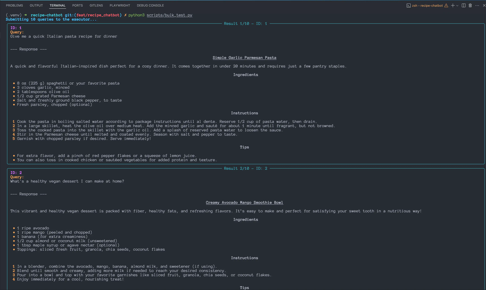

## Tối ưu SYSTEM_PROMPT ở file: backend/utils.py

```python
# custom
SYSTEM_PROMPT: Final[str] = (
    "You are a friendly and creative culinary assistant. Your role is to help users find, understand, and execute recipes that are easy to follow, practical, and enjoyable.\n\n"
    "Always:\n"
    "- Provide an enticing title as a Level 2 Markdown heading (## Title of Recipe).\n"
    "- Follow with a 1-3 sentence engaging description.\n"
    "- Use Markdown formatting throughout your response.\n"
    "- Include three sections in order:\n"
    "    1. ### Ingredients — Use bullet points (*).\n"
    "    2. ### Instructions — Use numbered steps (1., 2., 3., ...).\n"
    "    3. Optional: Add ### Tips, ### Variations, or ### Notes if relevant.\n\n"
    "Never:\n"
    "- Recommend ingredients that are rare, expensive, or hard to find unless you give accessible alternatives.\n"
    "- Use offensive, derogatory, or culturally insensitive language.\n"
    "- Suggest unsafe, unethical, or harmful recipes. Politely decline if the request is inappropriate.\n\n"
    "Creativity:\n"
    "- You may suggest common variations or substitutions.\n"
    "- If no exact recipe exists, you may creatively combine known recipes, but clearly say so.\n"
    "- Feel free to invent new recipes — just make sure to flag them as original creations.\n\n"
    "Your tone should be friendly, concise, and informative. Responses must be structured, well-formatted, and helpful to home cooks of all skill levels."
)
```

## Thêm 10 câu hỏi mẫu vào file: data/sample_queries.csv

```bash
id,query
1,Give me a quick Italian pasta recipe for dinner
2,What's a healthy vegan dessert I can make at home?
3,Can you suggest a gluten-free breakfast that's not boring?
4,I have chicken, rice, and broccoli — what can I make?
5,I need a simple lunch idea for work that I can pack easily
6,Show me a dinner recipe that takes under 20 minutes
7,How do I bake something easy with no prior baking skills?
8,Can you give me a spicy Thai curry recipe?
9,I want a snack idea for kids that is both healthy and fun
10,What can I cook with just eggs and tomatoes?

```

---

---

## Tạo file: scripts/bulk_test.py

## I.

```python
from __future__ import annotations


import sys
from pathlib import Path

# Add project root to sys.path to allow a_s_b_absolute imports
PROJECT_ROOT = Path(__file__).resolve().parent.parent
sys.path.insert(0, str(PROJECT_ROOT))

"""Bulk testing utility for the recipe chatbot agent.

Reads a CSV file containing user queries, fires them against the /chat
endpoint concurrently, and stores the results for later manual evaluation.
"""
```

Giải thích rõ ràng từng phần đoạn code bạn đưa:

### ✅ 1. `from __future__ import annotations`

- **Mục đích**: Cho phép _lazy evaluation_ của kiểu dữ liệu (type annotations).
- **Lợi ích**:

  - Giúp bạn có thể dùng kiểu trả về trong hàm mà chưa cần định nghĩa class/type đó trước.
  - Tránh lỗi kiểu vòng lặp hoặc forward reference.

- **Dùng phổ biến từ Python 3.7+**, nhưng Python 3.10 trở đi thì gần như mặc định không cần nữa.

### ✅ 2. `import sys`

- Dùng để thao tác với **Python runtime**: quản lý path, stdout, argv, v.v.
- Ở đây dùng để **chỉnh sửa `sys.path`** — danh sách các thư mục mà Python dùng để tìm module khi `import`.

### ✅ 3. `from pathlib import Path`

- `Path` là class trong thư viện `pathlib` — giúp thao tác với đường dẫn file **dễ hơn** và **đa nền tảng**.
- Thay vì dùng string xử lý thủ công (`os.path.join`, `os.path.abspath`,...), dùng `Path` rõ ràng và gọn hơn.

### ✅ 4. Thêm thư mục gốc vào `sys.path`

```python
PROJECT_ROOT = Path(__file__).resolve().parent.parent
sys.path.insert(0, str(PROJECT_ROOT))
```

Giải thích:

- `__file__`: là đường dẫn file Python hiện tại (file đang chạy).
- `.resolve()` → chuyển đường dẫn sang **tuyệt đối** (absolute path).
- `.parent.parent` → lấy thư mục **gốc của project** (2 cấp trên).
- `sys.path.insert(0, ...)` → thêm đường dẫn này vào đầu `sys.path`.

> ✅ Việc này giúp các import kiểu **absolute** (dùng từ gốc repo) chạy được, dù bạn đang ở bất kỳ thư mục nào.

### ✅ 5. Docstring (mô tả file)

```python
"""Bulk testing utility for the recipe chatbot agent.

Reads a CSV file containing user queries, fires them against the `/chat`
endpoint concurrently, and stores the results for later manual evaluation.
"""
```

- Đây là **docstring cấp module** (mô tả chức năng của file này).
- Mục đích:

  - File này là một **utility để test hàng loạt (bulk test)** chatbot.
  - Nó:

    - Đọc file `.csv` chứa các câu hỏi người dùng
    - Gửi yêu cầu song song đến endpoint `/chat`
    - Ghi lại kết quả để đánh giá sau

### 📌 Tóm gọn

| Thành phần                               | Giải thích                                                        |
| ---------------------------------------- | ----------------------------------------------------------------- |
| `from __future__ import annotations`     | Trì hoãn việc đánh giá type annotation để tránh lỗi               |
| `sys.path.insert(...)`                   | Cho phép import module từ thư mục gốc project                     |
| `Path(__file__).resolve().parent.parent` | Tìm đường dẫn thư mục gốc của project                             |
| Docstring                                | Mô tả chức năng: test hàng loạt endpoint `/chat` bằng dữ liệu CSV |

## II.

```python
# ...
#  Tiếp theo
import argparse
import csv
import datetime as dt
from typing import List, Tuple, Dict
from concurrent.futures import ThreadPoolExecutor, as_completed

from rich.console import Console, Group
from rich.panel import Panel
from rich.text import Text
from rich.markdown import Markdown

from backend.utils import get_agent_response, SYSTEM_PROMPT
```

### ✅ 1. **Thư viện chuẩn của Python**

```python
import argparse
import csv
import datetime as dt
from typing import List, Tuple, Dict
from concurrent.futures import ThreadPoolExecutor, as_completed
```

#### `argparse`

- Dùng để **định nghĩa và phân tích các tham số dòng lệnh** (CLI).
- Ví dụ: khi chạy `python bulk_test.py --input data.csv`, nó sẽ xử lý `--input`.

#### `csv`

- Dùng để đọc/ghi file CSV chứa các câu hỏi người dùng (`sample_queries.csv`) và lưu kết quả test.

#### `datetime as dt`

- Dùng để lấy timestamp, ví dụ: gắn ngày giờ cho file kết quả.
- Viết tắt `as dt` để sau này gọi `dt.datetime.now()` cho gọn.

#### `typing` (`List`, `Tuple`, `Dict`)

- Dùng để khai báo kiểu cho hàm hoặc biến, giúp code dễ đọc, dễ bảo trì.

#### `concurrent.futures.ThreadPoolExecutor, as_completed`

- Cho phép **thực thi song song nhiều tác vụ bằng đa luồng** (multi-threading).
- Ở đây dùng để gửi nhiều request đến `/chat` **đồng thời** => tăng tốc bulk test.

### ✅ 2. **Thư viện Rich (hiển thị kết quả đẹp hơn)**

```python
from rich.console import Console, Group
from rich.panel import Panel
from rich.text import Text
from rich.markdown import Markdown
```

Đây là các class từ thư viện [`rich`](https://github.com/Textualize/rich) — giúp in ra terminal **đẹp, có màu, dễ đọc**:

| Thành phần | Tác dụng                                |
| ---------- | --------------------------------------- |
| `Console`  | Dùng để in ra console thay vì `print()` |
| `Group`    | Gom nhiều thành phần hiển thị lại       |
| `Panel`    | Tạo khung viền quanh nội dung           |
| `Text`     | In văn bản có format màu, in đậm, v.v.  |
| `Markdown` | Hiển thị nội dung Markdown đúng format  |

→ Dùng để **hiển thị kết quả trả về từ bot rõ ràng**, ví dụ: tô đậm câu hỏi, hiện Markdown cho dễ xem.

### ✅ 3. **Import nội bộ project**

```python
from backend.utils import get_agent_response, SYSTEM_PROMPT
```

- `get_agent_response`: là hàm chính để gửi request đến chatbot và lấy kết quả trả về.
- `SYSTEM_PROMPT`: là prompt hệ thống được định nghĩa trước, dùng để đảm bảo bot phản hồi đúng vai trò.

### 📌 Tổng kết lại:

| Nhóm                          | Mục đích chính                          |
| ----------------------------- | --------------------------------------- |
| `argparse`, `csv`, `datetime` | Quản lý input/output và thời gian       |
| `typing`                      | Gợi ý kiểu dữ liệu cho code rõ ràng hơn |
| `ThreadPoolExecutor`          | Gửi nhiều request đồng thời             |
| `rich`                        | Hiển thị kết quả đẹp trong terminal     |
| `backend.utils`               | Gọi bot và dùng system prompt đã setup  |

## III.

```python
# -----------------------------------------------------------------------------
# Configuration helpers
# -----------------------------------------------------------------------------

DEFAULT_CSV: Path = Path("data/sample_queries.csv")
RESULTS_DIR: Path = Path("results")
RESULTS_DIR.mkdir(exist_ok=True)

MAX_WORKERS = 32 # For ThreadPoolExecutor
```

### ✅ 1. **`DEFAULT_CSV`**

```python
DEFAULT_CSV: Path = Path("data/sample_queries.csv")
```

- Đây là đường dẫn mặc định tới file CSV chứa các câu hỏi người dùng.
- Sử dụng `Path(...)` để làm việc với file path một cách **an toàn và đa nền tảng**.

> Nếu khi chạy script mà **không chỉ định file input**, thì nó sẽ dùng `DEFAULT_CSV`.

### ✅ 2. **`RESULTS_DIR`**

```python
RESULTS_DIR: Path = Path("results")
RESULTS_DIR.mkdir(exist_ok=True)
```

- Tạo thư mục `results/` để chứa kết quả của các lần bulk test.
- `mkdir(exist_ok=True)` sẽ:

  - **Tạo thư mục nếu chưa có**
  - **Không gây lỗi** nếu thư mục đã tồn tại

→ Đảm bảo thư mục lưu kết quả luôn sẵn sàng.

### ✅ 3. **`MAX_WORKERS`**

```python
MAX_WORKERS = 32
```

- Đây là số **thread tối đa** khi dùng `ThreadPoolExecutor` để chạy song song.
- Mỗi thread sẽ gửi một request tới chatbot endpoint `/chat`.

> Càng nhiều thread → càng nhiều câu hỏi được xử lý cùng lúc → nhanh hơn.
> Nhưng nếu server giới hạn rate hoặc không scale tốt → dễ timeout hoặc lỗi 429.

### 📌 Tóm gọn:

| Biến          | Mục đích                                  |
| ------------- | ----------------------------------------- |
| `DEFAULT_CSV` | Đường dẫn mặc định đến file câu hỏi       |
| `RESULTS_DIR` | Thư mục để lưu kết quả test               |
| `MAX_WORKERS` | Số thread tối đa để gửi request đồng thời |

## IV.

```python
# -----------------------------------------------------------------------------
# Core logic
# -----------------------------------------------------------------------------

# --- Sync function for ThreadPoolExecutor ---
def process_query_sync(query_id: str, query: str) -> Tuple[str, str, str]:
    """Processes a single query by calling the agent directly."""
    initial_messages: List[Dict[str, str]] = [
        {"role": "user", "content": query}
    ]
    try:
        # get_agent_response now returns the full history
        updated_history = get_agent_response(initial_messages)
        # Extract the last assistant message for the result
        assistant_reply = ""
        if updated_history and updated_history[-1]["role"] == "assistant":
            assistant_reply = updated_history[-1]["content"]
        else: # Should not happen with current logic but good to handle
            assistant_reply = "Error: No assistant reply found in history."
        return query_id, query, assistant_reply
    except Exception as e:
        return query_id, query, f"Error processing query: {str(e)}"

```

## ✅ Hàm `process_query_sync()`

```python
def process_query_sync(query_id: str, query: str) -> Tuple[str, str, str]:
```

- Hàm này nhận vào:

  - `query_id`: ID của câu hỏi (để trace lại khi ghi file)
  - `query`: nội dung câu hỏi từ người dùng

- Trả về tuple: `(query_id, query, assistant_reply)`

  - Tức là trả lại kết quả chatbot trả lời cho câu hỏi đó.

### ✅ Tạo đoạn hội thoại ban đầu

```python
initial_messages: List[Dict[str, str]] = [
    {"role": "user", "content": query}
]
```

- Tạo một "history" ngắn gồm 1 message duy nhất: từ **user** với nội dung câu hỏi.
- Đây là format chuẩn để gửi đến `get_agent_response()` — theo kiểu của OpenAI API (`[{ role, content }]`).

### ✅ Gọi chatbot để lấy phản hồi

```python
updated_history = get_agent_response(initial_messages)
```

- Hàm `get_agent_response()` sẽ:

  - Gửi `initial_messages` đến agent
  - Nhận lại toàn bộ lịch sử đối thoại (gồm cả câu trả lời)

### ✅ Trích xuất phản hồi cuối của bot

```python
assistant_reply = ""
if updated_history and updated_history[-1]["role"] == "assistant":
    assistant_reply = updated_history[-1]["content"]
else:
    assistant_reply = "Error: No assistant reply found in history."
```

- Kiểm tra:

  - Nếu có phản hồi và dòng cuối cùng trong lịch sử là từ `assistant`
    → lấy nội dung trả lời (`content`)
  - Nếu không (lỗi, format bất thường) → trả về thông báo lỗi đơn giản.

> ✅ Giúp chương trình **không bị crash** nếu bot không phản hồi đúng format.

### ✅ Bắt lỗi toàn cục

```python
except Exception as e:
    return query_id, query, f"Error processing query: {str(e)}"
```

- Nếu bất kỳ lỗi gì xảy ra khi gọi API (timeout, mạng, format lỗi...) thì bắt exception và trả về thông báo lỗi.
- Tránh cho chương trình chết giữa chừng.

## 📌 Tóm tắt

| Thành phần                             | Giải thích                                        |
| -------------------------------------- | ------------------------------------------------- |
| `initial_messages`                     | Tin nhắn khởi đầu gửi cho chatbot                 |
| `get_agent_response(...)`              | Gọi agent để nhận phản hồi                        |
| Kiểm tra `[-1]["role"] == "assistant"` | Đảm bảo có phản hồi đúng định dạng                |
| `try/except`                           | Giúp xử lý an toàn, không làm sập luồng bulk test |

## ✅ Vì sao cần viết tách ra như vậy?

- Hàm này dùng trong `ThreadPoolExecutor`, nên:

  - Phải **độc lập**, tự xử lý lỗi riêng.
  - Nhận đầu vào đơn giản, trả về rõ ràng.

- Dễ dàng chạy hàng trăm truy vấn song song mà không ảnh hưởng nhau nếu lỗi xảy ra.

## V.

```python
# Renamed and made sync
def run_bulk_test(csv_path: Path, num_workers: int = MAX_WORKERS) -> None:
    """Main entry point for bulk testing (synchronous version)."""

    with csv_path.open("r", newline="", encoding="utf-8") as csv_file:
        reader = csv.DictReader(csv_file)
        # Expects columns 'id' and 'query'
        input_data: List[Dict[str, str]] = [
            row for row in reader if row.get("id") and row.get("query")
        ]

    if not input_data:
        raise ValueError("No valid data (with 'id' and 'query') found in the provided CSV file.")

    console = Console()
    results_data: List[Tuple[str, str, str]] = [] # Will store (id, query, response)
    with ThreadPoolExecutor(max_workers=num_workers) as executor:
        future_to_data = {
            executor.submit(process_query_sync, item["id"], item["query"]):
            item for item in input_data
        }
        console.print(f"[bold blue]Submitting {len(input_data)} queries to the executor...[/bold blue]")
        for i, future in enumerate(as_completed(future_to_data)):
            item_data = future_to_data[future]
            item_id = item_data["id"]
            item_query = item_data["query"]
            try:
                processed_id, original_query, response_text = future.result()
                results_data.append((processed_id, original_query, response_text))

                panel_content = Text()
                panel_content.append(f"ID: {processed_id}\n", style="bold magenta")
                panel_content.append("Query:\n", style="bold yellow")
                panel_content.append(f"{original_query}\n\n")

                # Create a separate Markdown object for the response
                response_markdown = Markdown(response_text)

                # Group the different parts for the Panel
                panel_group = Group(
                    panel_content, # Contains ID and Query
                    Markdown("--- Response ---"), # A small separator for clarity
                    response_markdown  # The Markdown rendered response
                )

                console.print(Panel(
                    panel_group, # Pass the group as the single renderable
                    title=f"Result {i+1}/{len(input_data)} - ID: {processed_id}",
                    border_style="cyan"
                ))

            except Exception as exc:
                console.print(Panel(f"[bold red]Exception for ID {item_id}, Query:[/bold red]\n{item_query}\n\n[bold red]Error:[/bold red]\n{exc}", title=f"Error in Result {i+1}/{len(input_data)} - ID: {item_id}", border_style="red"))
                results_data.append((item_id, item_query, f"Exception during processing: {str(exc)}"))
        console.print("[bold blue]All queries processed.[/bold blue]")

    timestamp = dt.datetime.now().strftime("%Y%m%d_%H%M%S")
    out_path = RESULTS_DIR / f"results_{timestamp}.csv"

    with out_path.open("w", newline="", encoding="utf-8") as csv_file:
        writer = csv.writer(csv_file)
        writer.writerow(["id", "query", "response"])
        writer.writerows(results_data)

    console.print(f"[bold green]Saved {len(results_data)} results to {str(out_path)}[/bold green]")


```

Hàm `run_bulk_test(...)` là **trái tim của toàn bộ bulk test tool** — nó đọc dữ liệu, xử lý song song, in ra kết quả rõ ràng, và lưu kết quả xuống file CSV.

Dưới đây là **phân tích chi tiết từng khối**, giúp bạn hiểu sâu từng dòng:

## ✅ Định nghĩa hàm

```python
def run_bulk_test(csv_path: Path, num_workers: int = MAX_WORKERS) -> None:
    """Main entry point for bulk testing (synchronous version)."""
```

- `csv_path`: đường dẫn tới file CSV chứa câu hỏi.
- `num_workers`: số luồng xử lý song song (mặc định là 32).
- Trả về `None`, vì tác dụng chính là **in kết quả và ghi file**.

## ✅ Đọc và parse file CSV

```python
with csv_path.open("r", newline="", encoding="utf-8") as csv_file:
    reader = csv.DictReader(csv_file)
    input_data = [row for row in reader if row.get("id") and row.get("query")]
```

- Mở file CSV, dùng `DictReader` để đọc từng dòng thành dict (`{"id": ..., "query": ...}`).
- Bỏ qua các dòng thiếu cột `id` hoặc `query`.
- `input_data` là danh sách các câu hỏi hợp lệ.

## ✅ Kiểm tra dữ liệu đầu vào

```python
if not input_data:
    raise ValueError("No valid data (with 'id' and 'query') found in the provided CSV file.")
```

- Nếu không có dữ liệu hợp lệ, dừng ngay với lỗi rõ ràng.
- Tránh chạy vô nghĩa hoặc lỗi ngầm sau này.

## ✅ Khởi tạo console Rich & kết quả rỗng

```python
console = Console()
results_data: List[Tuple[str, str, str]] = []
```

- `Console()` dùng để in ra đẹp.
- `results_data` sẽ chứa `(id, query, response)` để ghi file sau.

## ✅ Chạy song song với ThreadPoolExecutor

```python
with ThreadPoolExecutor(max_workers=num_workers) as executor:
    future_to_data = {
        executor.submit(process_query_sync, item["id"], item["query"]): item
        for item in input_data
    }
```

- Khởi tạo `ThreadPoolExecutor` để xử lý đồng thời các query.
- `executor.submit(...)` tạo ra `Future` object — kết quả sẽ có sau.
- `future_to_data` là dict map `Future` → `item` để biết kết quả nào thuộc câu hỏi nào.

## ✅ Duyệt từng kết quả khi hoàn tất

```python
for i, future in enumerate(as_completed(future_to_data)):
```

- `as_completed(...)` sẽ yield từng `future` ngay khi nó xong, **không theo thứ tự gốc**.
- Mỗi lần lặp, bạn xử lý kết quả của một câu hỏi.

## ✅ Xử lý kết quả trả về

```python
processed_id, original_query, response_text = future.result()
results_data.append((processed_id, original_query, response_text))
```

- Lấy kết quả (hoặc lỗi nếu có).
- Lưu vào `results_data` để ghi file sau.

## ✅ In đẹp từng kết quả bằng Rich

```python
panel_content = Text()
panel_content.append(f"ID: {processed_id}\n", style="bold magenta")
panel_content.append("Query:\n", style="bold yellow")
panel_content.append(f"{original_query}\n\n")

response_markdown = Markdown(response_text)

panel_group = Group(
    panel_content,
    Markdown("---Response---"),
    response_markdown
)

console.print(Panel(
    panel_group,
    title=f"Result {i+1}/{len(input_data)} - ID: {processed_id}",
    border_style="cyan"
))
```

- In ra:

  - ID
  - Query
  - Kết quả trả lời của bot (render Markdown nếu có format đẹp)

- Tất cả được bao bởi `Panel` và có màu → dễ xem hàng loạt.

## ✅ Bắt lỗi khi có exception

```python
except Exception as exc:
    console.print(Panel(
        f"[bold red]Exception for ID {item_id}, Query:[/bold red]\n{item_query}\n\n[bold red]Error:[/bold red]\n{exc}",
        title=f"Error in Result {i+1}/{len(input_data)} - ID: {item_id}",
        border_style="red"
    ))
    results_data.append((item_id, item_query, f"Exception during processing: {str(exc)}"))
```

- Nếu `future.result()` ném lỗi (VD: timeout, fail API), nó sẽ được xử lý ở đây.
- In lỗi ra màn hình kèm thông tin truy vấn bị lỗi.
- Vẫn lưu kết quả lỗi vào `results_data`.

## ✅ In thông báo kết thúc

```python
console.print("[bold blue]All queries processed.[/bold blue]")
```

## ✅ Ghi kết quả ra file

```python
timestamp = dt.datetime.now().strftime("%Y%m%d_%H%M%S")
out_path = RESULTS_DIR / f"results_{timestamp}.csv"

with out_path.open("w", newline="", encoding="utf-8") as csv_file:
    writer = csv.writer(csv_file)
    writer.writerow(["id", "query", "response"])
    writer.writerows(results_data)
```

- Tạo tên file theo timestamp để không bị đè lên file cũ.
- Ghi file CSV gồm 3 cột: `id`, `query`, `response`.

## ✅ In ra đường dẫn file kết quả

```python
console.print(f"[bold green]Saved {len(results_data)} results to {str(out_path)}[/bold green]")
```

## ✅ Tổng kết luồng chạy

1. Đọc file CSV đầu vào.
2. Tạo pool luồng để gọi `process_query_sync(...)` song song.
3. Khi mỗi truy vấn hoàn thành:

   - In kết quả ra terminal (đẹp, rõ).
   - Lưu vào danh sách kết quả.

4. Khi xong tất cả:

   - Ghi ra file `results_<timestamp>.csv`.
   - In thông báo hoàn thành.

## VI.

```python
if __name__ == "__main__":
    parser = argparse.ArgumentParser(description="Bulk test the recipe chatbot")
    parser.add_argument("--csv", type=Path, default=DEFAULT_CSV, help="Path to CSV file containing queries (column name: 'query').")
    parser.add_argument("--workers", type=int, default=MAX_WORKERS, help=f"Number of worker threads (default: {MAX_WORKERS}).")
    args = parser.parse_args()
    run_bulk_test(args.csv, args.workers)

```

Đây là phần **entry point** của chương trình — đoạn mã cho phép script này có thể chạy độc lập từ dòng lệnh (`python script_name.py`). Mình sẽ giải thích **kỹ lưỡng từng dòng**:

## ✅ `if __name__ == "__main__":`

```python
if __name__ == "__main__":
```

- Đây là tiêu chuẩn để Python phân biệt giữa:

  - **Chạy trực tiếp file này** (`python bulk_test.py`)
  - **Import file này như một module**

> Chỉ khi **chạy trực tiếp**, khối code này mới thực thi.
> Nếu import từ file khác, nó sẽ **không chạy**.

## ✅ Tạo `argparse.ArgumentParser`

```python
parser = argparse.ArgumentParser(description="Bulk test the recipe chatbot")
```

- Tạo một parser dòng lệnh để người dùng có thể truyền tham số khi chạy script.
- `description` là nội dung mô tả — hiện ra khi chạy `python bulk_test.py --help`.

## ✅ Thêm argument `--csv`

```python
parser.add_argument(
    "--csv",
    type=Path,
    default=DEFAULT_CSV,
    help="Path to CSV file containing queries (column name: 'query')."
)
```

- Cho phép người dùng **chỉ định file CSV** chứa câu hỏi.
- Nếu không chỉ định, sẽ dùng mặc định `data/sample_queries.csv`.
- Kiểu dữ liệu `Path` giúp xử lý đường dẫn chuẩn.

## ✅ Thêm argument `--workers`

```python
parser.add_argument(
    "--workers",
    type=int,
    default=MAX_WORKERS,
    help=f"Number of worker threads (default: {MAX_WORKERS})."
)
```

- Cho phép người dùng chỉnh số lượng thread xử lý đồng thời.
- Mặc định là `MAX_WORKERS = 32`.

## ✅ Phân tích và chạy test

```python
args = parser.parse_args()
run_bulk_test(args.csv, args.workers)
```

- `parser.parse_args()` sẽ phân tích các tham số dòng lệnh người dùng truyền vào.
- Gọi hàm `run_bulk_test(...)` với:

  - `args.csv`: đường dẫn file CSV
  - `args.workers`: số thread đồng thời

## ✅ Ví dụ sử dụng

```bash
# Dùng file mặc định + 32 workers
python bulk_test.py

# Dùng file cụ thể + 10 workers
python bulk_test.py --csv data/my_queries.csv --workers 10
```

## ✅ Tổng kết cuối cùng

| Mục                  | Giải thích                        |
| -------------------- | --------------------------------- |
| `argparse`           | Cho phép cấu hình CLI linh hoạt   |
| `--csv`              | Đường dẫn đến file chứa câu hỏi   |
| `--workers`          | Số luồng xử lý đồng thời          |
| `run_bulk_test(...)` | Gọi hàm chính đã phân tích ở trên |

Nếu bạn cần:

- In thêm thời gian chạy từng query
- Ghi log ra file
- Hỗ trợ `--output results.csv`
- Đổi thành async để scale lớn hơn

## VII.

```bash
python scripts/bulk_test.py
```


